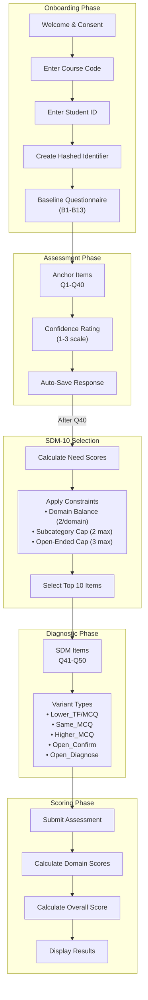

# Assessment Flow

This diagram shows the complete student journey through the Financial Literacy Assessment.

## Overview

Students progress through five phases:
1. **Onboarding** - Consent, authentication, baseline demographics
2. **Assessment** - 40 anchor items with confidence ratings
3. **SDM Selection** - Adaptive algorithm selects follow-up items
4. **Diagnostic** - 10 supplemental items based on response patterns
5. **Scoring** - Domain and overall score calculation

## Flow Diagram

## Phase Details

### 1. Onboarding Phase
- IRB-approved consent disclosure
- Course code + student ID authentication
- SHA-256 hashing of student identifier (FERPA compliant)
- 13-item baseline questionnaire (B1-B13)

### 2. Assessment Phase
- 40 anchor items presented one at a time
- Each item includes confidence rating (1-3 scale)
- Auto-save after each response
- Progress indicator shows current position

### 3. SDM-10 Selection
- Information deficit model calculates Need scores
- Domain balance constraint (minimum 2 per domain)
- Subcategory cap (maximum 2 per subcategory)
- Open-ended cap (maximum 3 items)

### 4. Diagnostic Phase
- 10 items selected from pre-written item bank
- Six variant types available per anchor item
- Targets uncertain correct answers and confident errors

### 5. Scoring Phase
- Domain scores calculated (Borrowing & Credit, Risk Management, Investment & Risk)
- Overall score aggregated from 26 knowledge items
- Overconfidence index computed from confidence vs. correctness
