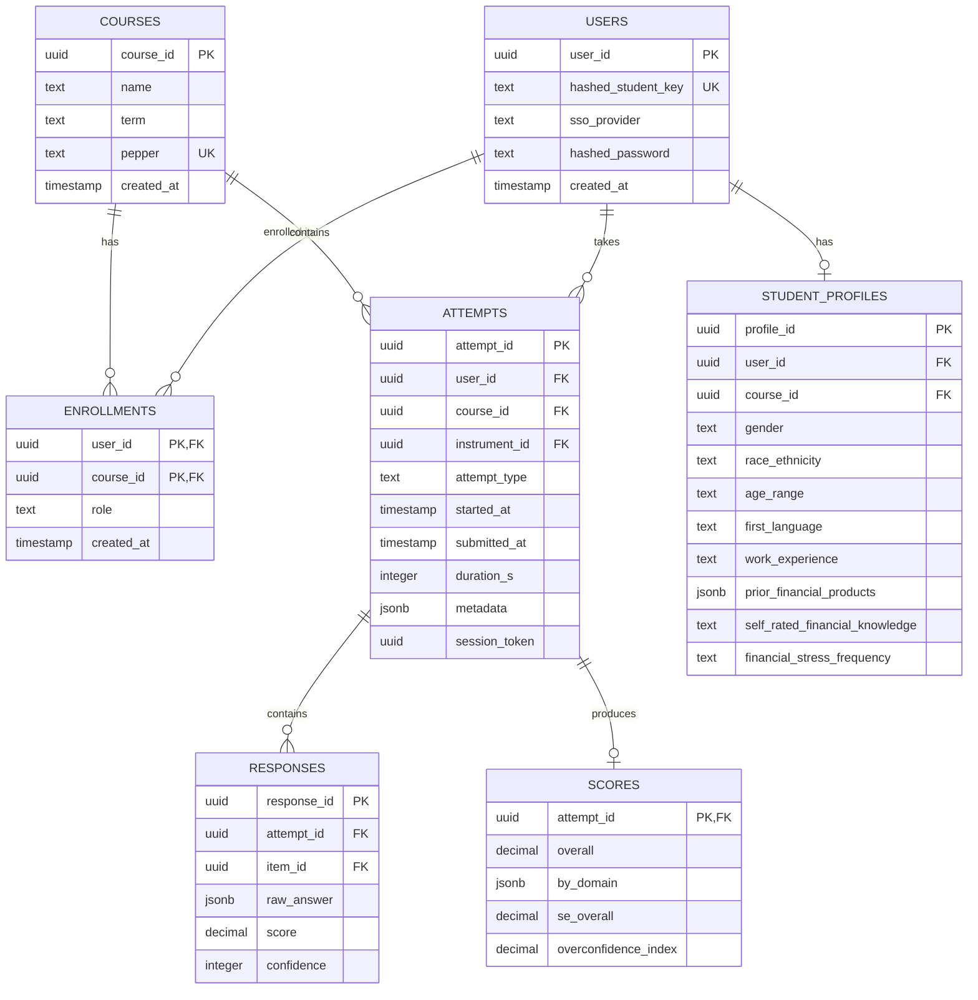

# Database Entity-Relationship Diagram

This diagram shows the complete data model for the Financial Literacy Assessment Platform.

## Overview

The database consists of **14 tables** organized into four functional groups:
- Core Assessment Tables (8)
- Baseline Covariates (1)
- Instructor Management (3)
- System Tables (2)

## ER Diagram

## Table Groups

### Core Assessment Tables

| Table | Purpose |
|-------|---------|
| `users` | Hashed student identifiers (FERPA compliant) |
| `courses` | Course metadata with per-course pepper |
| `enrollments` | User-course associations |
| `instruments` | Assessment forms/versions |
| `items` | Question bank |
| `attempts` | Assessment attempt records |
| `responses` | Individual item responses |
| `scores` | Calculated domain/overall scores |

### Baseline Covariates

| Table | Purpose |
|-------|---------|
| `student_profiles` | Demographic and socioeconomic data (B1-B13) |

### Instructor Management

| Table | Purpose |
|-------|---------|
| `instructors` | Instructor accounts |
| `instructor_courses` | Course assignments |
| `instructor_sessions` | Token-based sessions |

## Key Relationships

- Each **user** can have multiple **attempts** across courses
- Each **attempt** contains multiple **responses** (one per item)
- Each **attempt** produces one **score** record
- Each **user** has one **student_profile** per course
- **Instructors** are linked to **courses** via assignments
