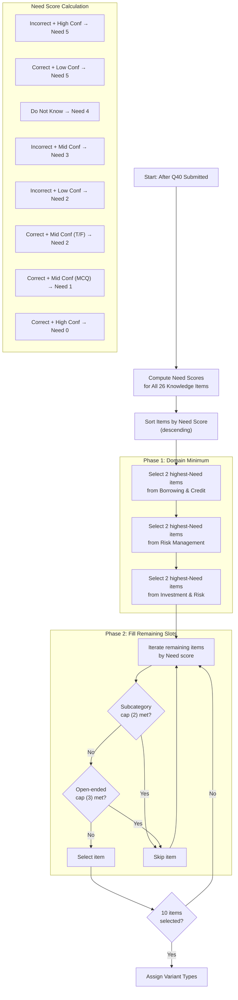

# SDM-10 Selection Algorithm

This diagram shows the Supplemental Diagnostic Module (SDM-10) item selection algorithm.

## Overview

The SDM-10 is a fixed-length adaptive follow-up consisting of 10 items selected based on students' anchor responses. The algorithm uses an **information deficit model** that prioritizes items where additional measurement would be most valuable.

## Selection Algorithm

## Need Score Rules

| Response Pattern | Need Score | Diagnostic Goal |
|------------------|------------|-----------------|
| Incorrect + High Confidence | 5 | Identify confident misconception |
| Correct + Low Confidence | 5 | Verify reasoning (possible guess) |
| Do Not Know | 4 | Test foundational knowledge |
| Incorrect + Mid Confidence | 3 | Clarify uncertain error |
| Incorrect + Low Confidence | 2 | Assess depth of knowledge gap |
| Correct + Mid Confidence (T/F) | 2 | Higher guess probability |
| Correct + Mid Confidence (MCQ) | 1 | Parallel difficulty check |
| Correct + High Confidence | 0 | Demonstrated mastery |

## Constraints

| Constraint | Rule |
|------------|------|
| SDM Size | Fixed 10 items |
| Domain Balance | At least 2 items per domain |
| Subcategory Cap | Maximum 2 items per subcategory |
| Open-Ended Cap | Maximum 3 open-ended items |
| Item Source | Pre-written item bank only |

## Variant Types

| Variant | Format | Level | Use Case |
|---------|--------|-------|----------|
| `Lower_TF` | True/False | Foundational | Basic recognition |
| `Lower_MCQ` | Multiple Choice | Foundational | Simplified reasoning |
| `Same_MCQ` | Multiple Choice | Comparable | Parallel difficulty |
| `Higher_MCQ` | Multiple Choice | Applied | Transfer/multi-step |
| `Open_Confirm` | Short Answer | Same | Verify uncertain correct |
| `Open_Diagnose` | Short Answer | Same | Identify misconception |
