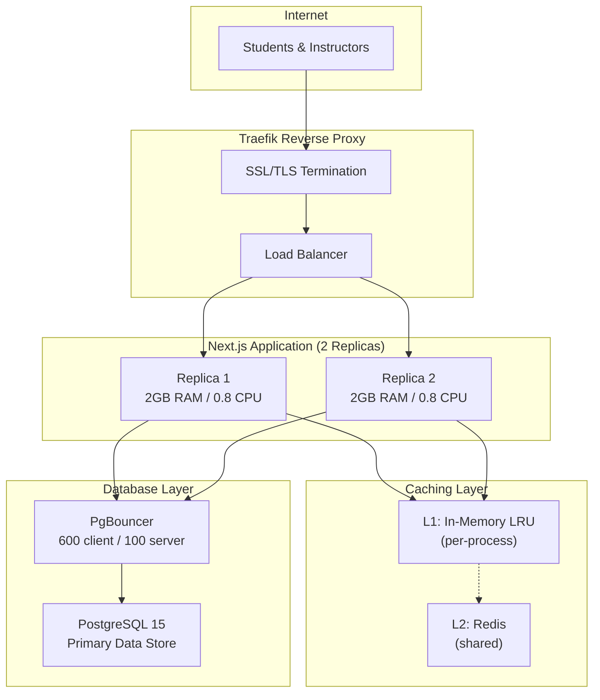

# System Architecture

This diagram shows the infrastructure topology of the Financial Literacy Assessment Platform.

## Overview

The platform uses a modern web application stack with the following components:

- **Traefik**: SSL termination and load balancing
- **Next.js 14**: Server-side rendering with 2 replicas
- **PgBouncer**: Connection pooling (600 client / 100 server)
- **PostgreSQL 15**: Primary data store
- **Redis**: Optional L2 cache layer

## Architecture Diagram

## Component Details

| Component | Technology | Purpose |
|-----------|------------|---------|
| Frontend | Next.js 14 (App Router) | Server-side rendering, React components |
| Backend | Next.js API Routes | RESTful endpoints, authentication |
| Database | PostgreSQL 15 | Primary data storage |
| Connection Pooling | PgBouncer | Transaction-mode pooling |
| Caching | Redis + In-Memory LRU | Two-tier cache |
| Deployment | Docker + Dokploy | Container orchestration |
| Reverse Proxy | Traefik | SSL termination, load balancing |

## Scaling

The platform is designed to handle approximately **500 concurrent users** with:
- 2 replicas × 2GB RAM × 0.8 CPU each
- Rolling deployments for zero-downtime updates
- Connection pooling to manage database load
